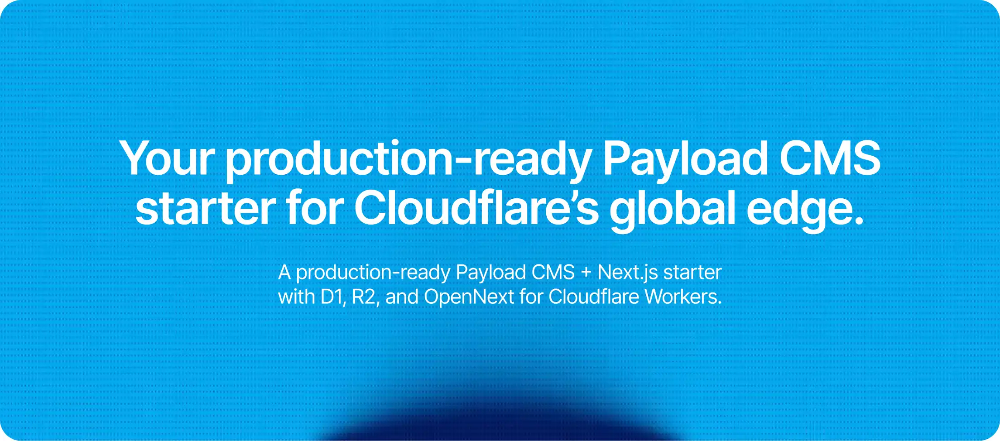

A minimal Payload CMS and Next.js starter for Cloudflare Workers.

Payload provides the admin panel and APIs, Next.js renders the website, and OpenNext deploys both as one Worker. Application data is stored in D1 and uploaded media is stored in R2.

It starts with authenticated admin users, public media uploads, a form builder, and a blank frontend ready for application-specific collections and pages.

## Run locally

Requirements: Node.js 20+, pnpm, and a Cloudflare account.

```bash
pnpm install
cp .env.example .env
pnpm wrangler login
pnpm dev
```

Set these values in `.env`:

```dotenv
PAYLOAD_SECRET=replace-with-a-random-secret
NEXT_PUBLIC_SERVER_URL=http://localhost:3000
MEDIA_ORIGIN=https://assets.example.com
```

Generate a secret with `openssl rand -hex 32`.

- Website: `http://localhost:3000`
- Payload admin: `http://localhost:3000/admin`
- REST API: `http://localhost:3000/api`
- GraphQL API: `http://localhost:3000/api/graphql`

## Configure Cloudflare

Replace the placeholder names and IDs in `wrangler.jsonc` with your Worker, D1, and R2 resources.

The app uses:

- `D1` for Payload data
- `R2` for Payload media uploads
- `NEXT_INC_CACHE_R2_BUCKET` for the Next.js incremental cache
- `NEXT_TAG_CACHE_D1` for cache-tag invalidation
- `NEXT_CACHE_DO_QUEUE` to coordinate ISR revalidation
- `WORKER_SELF_REFERENCE` as the Worker's self-service binding

### Enable D1 read replication

The `first-primary` strategy is enabled in `src/payload.config.ts`, but replicas must also be enabled on the database itself:

1. Open the D1 database in the Cloudflare dashboard.
2. Go to **Settings**.
3. Enable **Read Replication**.

### Configure the media domain and cache

Connect the media R2 bucket to a custom domain such as `assets.yoursite.com`, then set `MEDIA_ORIGIN` to that URL in your local environment and Cloudflare Worker environment. The app fails fast in production if it is missing.

Cloudflare's default Browser Cache TTL is four hours. Under **Caching → Cache Rules**, create a rule named **R2 images - 30 day browser TTL** that keeps images in both Cloudflare's edge cache and visitors' browser caches for longer.

Match the media hostname and only image extensions:

```text
(http.host eq "assets.yoursite.com" and http.request.uri.path.extension in {"avif" "gif" "jpg" "jpeg" "png" "svg" "webp"})
```

Use these settings:

- **Cache eligibility:** Eligible for cache
- **Edge TTL:** Ignore cache-control header and use **30 days**
- **Browser TTL:** Override origin and use **30 days**

A Cloudflare cache purge cannot remove files already stored in visitors' browsers. When replacing a media file, use a new or versioned filename so its URL changes.

#### Cache R2 videos

Create a second, mutually exclusive Cache Rule named **R2 videos - 1 year edge, 7 day browser** so large, immutable files remain at the edge longer without keeping them in visitors' browsers for a full month.

Match both of these conditions:

- **Hostname equals `assets.yoursite.com`**
- **File extension is in `webm`, `mp4`**

The equivalent expression is:

```text
(http.host eq "assets.yoursite.com" and http.request.uri.path.extension in {"webm" "mp4"})
```

Use these settings:

- **Cache eligibility:** Eligible for cache
- **Edge TTL:** Ignore cache-control header and use **1 year**
- **Browser TTL:** Override origin and use **7 days**

The image and video extension sets do not overlap, so the order of these two rules does not affect their TTL settings.

Cloudflare's edge cache accepts files up to 512 MB on Free, Pro, and Business plans. Larger videos can still be served from R2, but they will not be stored in the edge cache.

Before deploying schema changes, create a Payload migration:

```bash
pnpm payload migrate:create
```

Deploy the database migration and application together:

```bash
pnpm deploy
```

## Optimizations

- **Next.js Cache Components** are enabled for explicit, composable server caching.
- **Metadata caching** keeps `robots.txt` and `llms.txt` on the `max` cache profile and `sitemap.xml` on the `hours` profile.
- **Persistent Next.js cache** stores SSG, ISR, and data-cache entries in R2.
- **Regional cache** keeps frequently read cache entries close to the Worker for up to one minute.
- **D1 read replicas** use Payload's `first-primary` strategy for consistent reads with lower latency after the initial primary query.
- **On-demand invalidation** uses D1 cache tags and includes a Payload plugin that can invalidate configured globals and their related collections.
- **Deduplicated revalidation** uses a Durable Object queue to avoid repeated ISR work.
- **Cloudflare image transformations** resize images at `/cdn-cgi/image`, negotiate the output format automatically, and default to quality 85.
- **Direct media delivery** serves production uploads from the configured media hostname instead of proxying them through Payload.
- **Static asset caching** keeps Next.js's hashed `/_next/static/*` files immutable for one year and manually managed `/static/*` files cached for 30 days.
- **React Compiler** is enabled for automatic React rendering optimizations.
- **Worker-aware bundling** keeps `jose` and `pg-cloudflare` external for the workerd runtime.
- **Production logging** writes structured JSON through `console`, which integrates with Cloudflare Workers logs.

## Static files

Put manually managed assets in `public/static/` (create the directory when needed):

```text
public/static/logo.svg  ->  /static/logo.svg
```

Everything under `/static/*` is served with:

```http
Cache-Control: public,max-age=2592000
```

These files are cached by browsers for 30 days. Versioned filenames such as `logo-v2.svg` or `logo.abcd1234.svg` are still useful when an update must appear immediately.

Other files placed directly in `public/` use Cloudflare's normal static-asset caching unless another rule is added to `public/_headers`.

## Useful commands

```bash
pnpm dev             # Start local development
pnpm build           # Build the Next.js application
pnpm preview         # Build and preview with OpenNext
pnpm deploy          # Migrate D1, optimize it, build, and deploy
pnpm generate:types  # Regenerate Cloudflare and Payload types
pnpm lint            # Run ESLint
```

Uploads are limited to 5 MB. Payload's Sharp-based crop and focal-point tools are disabled because Sharp is not supported in the Workers runtime.
